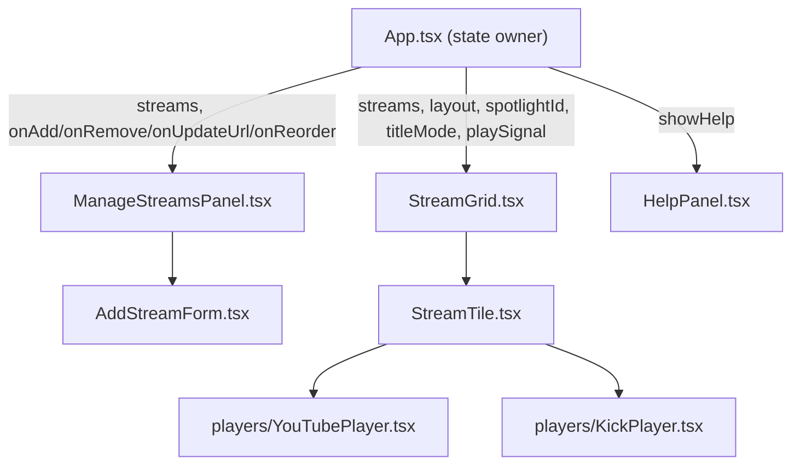

# ARP Multi View — Technical Specification

Design/reference document for developers. For end-user instructions, see [README.md](../README.md).
This file describes what each source file contains and what each function/component does, so
future changes can be made without re-reading the entire codebase.

## Stack & tooling

- **React 19 + TypeScript**, built with **Vite 8** (`@vitejs/plugin-react`).
- No backend, router, state library, or CSS framework — plain hooks, plain CSS
  (`src/App.css`, `src/index.css`), client-only.
- Lint: **Oxlint** (`.oxlintrc.json` — `react/rules-of-hooks: error`,
  `react/only-export-components: warn`). Run via `npm run lint`.
- Build: `npm run build` runs `tsc -b` (project-wide type check, no emit) then `vite build`.
- `tsconfig.app.json`: `target: es2023`, `moduleResolution: bundler`, `noUnusedLocals`/
  `noUnusedParameters`/`erasableSyntaxOnly` all on — dead/unused code and TS-only (non-erasable)
  syntax fail the build.
- No test runner is configured.

## Project structure

```
src/
  main.tsx                    — entry point, mounts <App/>
  App.tsx                     — root component: state + handlers + toolbar
  App.css                     — component-level styles
  index.css                   — global reset + theme CSS variables
  types.ts                    — shared domain types
  lib/
    parseStreamUrl.ts         — URL -> StreamSource parsing
    streamTitle.ts            — best-effort title/channel name lookup
    layout.ts                 — grid CSS generation (auto/2x2/4x4 + Spotlight)
    useLocalStorage.ts        — generic persisted-state hook
    youtubeApi.ts             — loads the YouTube IFrame Player API script once
    youtubeEmbed.ts           — builds YouTube iframe embed src URLs
    youtube.d.ts              — hand-written YT.* global type declarations
  components/
    ManageStreamsPanel.tsx    — collapsible URL list (+ AddStreamForm)
    AddStreamForm.tsx         — paste-URLs textarea + add button
    StreamGrid.tsx            — lays out tiles for the active layout mode
    StreamTile.tsx            — one tile: toolbar + embedded player + drag/drop
    HelpPanel.tsx             — in-app usage guide (modal)
    ProviderIcon.tsx          — YouTube/Kick circular glyph
    players/
      YouTubePlayer.tsx       — YouTube iframe + IFrame Player API wiring
      KickPlayer.tsx          — Kick iframe (no parent-page control API)
```

## Architecture / data flow

`App.tsx` is the single owner of all persisted state. It passes the same `streams` array (and
mutator callbacks) down to both `ManageStreamsPanel` (the editable row list) and `StreamGrid`
(the video tiles), so the two views never fall out of sync — every mutation goes through one of
`App.tsx`'s handlers, which calls `setStreams` once.



State lives in `App.tsx` via `useLocalStorage` (see table below) plus two pieces of
non-persisted `useState`: `playSignal` (a counter that tells every `YouTubePlayer` to attempt
`playVideo()`) and `isMaximized`/`showHelp` (transient UI toggles, not persisted).

## Persisted state (`useLocalStorage` keys)

| Key                          | Type                | Default     | Owner (App.tsx)          |
|------------------------------|---------------------|-------------|---------------------------|
| `arp-multi-view:streams`    | `StreamSource[]`    | `[]`        | `streams` / `setStreams`  |
| `arp-multi-view:layout`     | `LayoutMode`        | `'auto'`    | `layout` / `setLayout`    |
| `arp-multi-view:spotlight`  | `string \| null`    | `null`      | `spotlightId` / `setSpotlightId` |
| `arp-multi-view:theme`      | `ThemeName`         | `'midnight'`| `theme` / `setTheme`      |
| `arp-multi-view:titleMode`  | `TitleMode`         | `'video'`   | `titleMode` / `setTitleMode` |

`useLocalStorage<T>(key, initialValue)` (`lib/useLocalStorage.ts`) is a generic `useState`
drop-in: lazily reads `localStorage[key]` once on mount (falling back to `initialValue` on
missing/corrupt JSON), and re-writes it in a `useEffect` on every change. Both read and write
are wrapped in `try/catch` — persistence is best-effort (private browsing, storage quota, or a
disabled `localStorage` won't crash the app, it just won't remember state).

## `src/types.ts`

- `StreamTarget` — discriminated union describing how a stream is embedded:
  `{ kind: 'youtube-video'; videoId }` | `{ kind: 'youtube-channel'; channelId }` (a channel's
  current live broadcast) | `{ kind: 'kick-channel'; slug }`.
- `Provider = 'youtube' | 'kick'` — collapses both YouTube kinds for UI grouping.
- `StreamSource` — one tile's full record: `{ id, url, label, target, muted }`. `label` is the
  placeholder shown until/unless `fetchStreamNames` resolves a real name.
- `LayoutMode = 'auto' | 'grid2x2' | 'grid4x4' | 'spotlight'`.
- `ThemeName = 'midnight' | 'ember' | 'aurora'`.
- `TitleMode = 'video' | 'channel'` — which resolved name a tile prefers to display.
- `providerOf(target): Provider` — maps a `StreamTarget.kind` to its `Provider` by checking
  whether `kind` starts with `'youtube'`.

## `src/main.tsx`

Mounts `<App />` into `#root` (from `index.html`) inside `<StrictMode>`. No routing, no other
providers.

## `src/App.tsx`

Root component. Declares the `LAYOUTS`/`THEMES` option lists used to render the toolbar
buttons, holds all state (see table above), and defines these handlers:

| Function | Responsibility |
|---|---|
| `handleAdd(rawText)` | Parses one or more pasted URLs via `parseStreamUrls`, appends the ones that parsed and aren't already in `streams` (exact URL match), returns the `ParseFailure[]` for the caller to display. |
| `handleRemove(id)` | Removes a stream by id; clears `spotlightId` if the removed stream was the current spotlight. |
| `handleUpdateUrl(id, rawUrl)` | Re-parses a single edited URL via `parseStreamUrl`; rejects duplicates of another existing stream; replaces `url`/`label`/`target` in place (keeps `id`/`muted`); returns an error string or `null`. |
| `handleReorder(draggedId, targetId)` | Splices the dragged stream out of `streams` and re-inserts it at the target's index. Shared by both tile drag-and-drop (`StreamGrid`/`StreamTile`) and row drag-and-drop (`ManageStreamsPanel`). |
| `handleToggleMute(id)` | Flips one stream's `muted` flag. |
| `handleMuteAll(muted)` | Sets `muted` on every stream whose `target.kind` starts with `'youtube'`; Kick streams are untouched (no parent-control API). |
| `handlePlayAll()` | Increments `playSignal`; every mounted `YouTubePlayer` reacts by attempting `playVideo()` if its player instance is ready. |

Render structure: corner controls (Help toggle `ℹ`, Maximize/Show-controls toggle) →
conditionally rendered `HelpPanel` → `app__controls` (header, `ManageStreamsPanel`, toolbar with
layout switch / theme switch / action switch: title-mode toggle `🎬`/`👤`, Play all `▶`, Mute
all `🔇`, Unmute all `🔊`) → `app__stage` containing `StreamGrid`. When `isMaximized` is true,
CSS (`.app--maximized`) hides `app__controls` and expands `app__stage` to fill the viewport.

## `src/lib/parseStreamUrl.ts`

- `SAFE_ID` — `^[A-Za-z0-9_-]{1,64}$` whitelist regex applied to every id before it's embedded
  into a constructed iframe `src` (defense in depth).
- `ParseSuccess { ok: true; source: StreamSource }`, `ParseFailure { ok: false; input; error }`,
  `ParseResult = ParseSuccess | ParseFailure`.
- `fail(input, error)` — builds a `ParseFailure`.
- `makeSource(url, target, label)` — builds a `ParseSuccess` with a fresh `crypto.randomUUID()`
  id and `muted: true` (streams always start muted).
- `parseYouTube(url, raw)` — recognizes `youtu.be/<id>`, `watch?v=`, `/embed/<id>`,
  `/embed/live_stream?channel=<id>`, `/live|shorts|v/<id>`, `/channel/<id>`. Explicitly rejects
  `/@handle` URLs (resolving a handle needs the YouTube Data API, which this app doesn't call).
- `parseKick(url, raw)` — extracts a channel slug from `kick.com/<slug>` or
  `player.kick.com/<slug>`; rejects reserved path segments (`category`, `browse`, `search`,
  `subscriptions`, `following`, `settings`) and `/videos/...` VOD links (not embeddable).
- `parseStreamUrl(rawInput)` — trims input, defaults a missing scheme to `https://`, rejects
  non-http(s) schemes, dispatches to `parseYouTube`/`parseKick` by hostname, or fails with
  "Only youtube.com, youtu.be, and kick.com URLs are supported."
- `parseStreamUrls(input)` — splits pasted text on newlines/commas and calls `parseStreamUrl`
  on each non-empty line independently.

## `src/lib/streamTitle.ts`

- `REQUEST_TIMEOUT_MS = 5000`.
- `fetchJson(url)` — `fetch` with an `AbortController` timeout; returns parsed JSON on an OK
  response, or `null` on any network error, non-OK status, CORS block, or timeout (never
  throws).
- `ResolvedStreamNames { videoName: string | null; channelName: string | null }`.
- `fetchStreamNames(target)`:
  - `youtube-video` — calls YouTube's public oEmbed endpoint
    (`youtube.com/oembed?url=...&format=json`, no API key needed); returns `title` as
    `videoName` and `author_name` as `channelName`.
  - `kick-channel` — calls Kick's public channel API
    (`kick.com/api/v2/channels/<slug>`); returns `user.username` as `channelName` and, if
    live, `livestream.session_title` as `videoName`.
  - `youtube-channel` (a channel's live broadcast) — returns `{ null, null }`; there's no
    single video URL to resolve client-side for this target kind.

## `src/lib/layout.ts`

- `computeGridStyle(mode, count)` — returns `gridTemplateColumns` for the non-Spotlight grid:
  fixed `repeat(2, ...)` / `repeat(4, ...)` for `grid2x2`/`grid4x4`, or
  `repeat(ceil(sqrt(count)), ...)` for `auto` so the grid stays roughly square.
- `computeSpotlightGridStyle(sideCount)` — returns `gridTemplateRows` for Spotlight's single
  shared grid container: one explicit row per side tile (minimum 1), so the main tile's CSS
  `grid-row: 1 / -1` (in `App.css`) can resolve `-1` against an explicit last line.

## `src/lib/useLocalStorage.ts`

`useLocalStorage<T>(key, initialValue)` — see "Persisted state" above.

## `src/lib/youtubeApi.ts`

`loadYouTubeApi()` — memoizes a single shared `Promise<typeof YT>` (`apiPromise`) so the
`https://www.youtube.com/iframe_api` script tag is injected and `window.onYouTubeIframeAPIReady`
is registered at most once, no matter how many `YouTubePlayer` instances call this. Chains onto
any pre-existing `onYouTubeIframeAPIReady` callback instead of overwriting it.

## `src/lib/youtubeEmbed.ts`

`buildYouTubeEmbedSrc(target)` — builds the iframe `src`:
`autoplay=0&mute=1&playsinline=1&rel=0&enablejsapi=1&origin=<window.location.origin>`, plus
either `/embed/<videoId>` or (`youtube-channel` targets) `/embed/live_stream?channel=<channelId>`.
`enablejsapi=1` + matching `origin` are required for the IFrame Player API to postMessage into
this iframe.

## `src/lib/youtube.d.ts`

Hand-written ambient declarations for only the `YT.*` surface this app calls: `Window.YT`,
`Window.onYouTubeIframeAPIReady`, and `YT.Player` (`constructor`, `playVideo`, `pauseVideo`,
`mute`, `unMute`, `isMuted`, `setVolume`, `destroy`) plus its event option types
(`onReady`/`onStateChange`/`onError`). Declared as a global namespace since the real script
attaches `window.YT`, not an ES module.

## `src/components/ManageStreamsPanel.tsx`

- `ManageStreamsPanel({ streams, onAdd, onRemove, onUpdateUrl, onReorder })` — a `<details open>`
  collapsible panel; renders `AddStreamForm` then one `StreamRow` per stream.
- `StreamRow({ index, source, onRemove, onUpdateUrl, onReorder })` — one editable row:
  - Local `value` state holds the draft URL text; only committed to the app via `onUpdateUrl`
    on submit (typing doesn't touch the grid until confirmed).
  - `handleSubmit` — no-ops (just clears any stale error) if the value is unchanged from
    `source.url`; otherwise calls `onUpdateUrl` and displays any returned error string.
  - `handleDragStart`/`handleDragOver`/`handleDrop` — native HTML5 drag-and-drop: stashes
    `source.id` in `dataTransfer`, and on drop calls `onReorder(draggedId, source.id)`. This
    row is always draggable (unlike tiles, which disable dragging in Spotlight).
  - Renders: drag indicator `⠿`, row index, `ProviderIcon`, URL text input, update button `✓`,
    remove button `🗑`, and an inline error message if `onUpdateUrl` returned one.

## `src/components/AddStreamForm.tsx`

`AddStreamForm({ onAdd })` — a `<textarea>` (one/comma-separated URLs per line) + `➕` submit
button. `handleSubmit` calls `onAdd(text)`; clears the textarea only if there were zero
failures, otherwise leaves the text in place and lists each `ParseFailure` (`input: error`)
below the form.

## `src/components/StreamGrid.tsx`

`StreamGrid({ streams, layout, spotlightId, titleMode, playSignal, onRemove, onReorder,
onToggleMute, onSetSpotlight })`:
- Renders an empty-state message if `streams.length === 0`.
- `tileProps(source)` — the prop bag shared by every `StreamTile` regardless of layout
  (`spotlightEnabled: layout === 'spotlight'`, plus all the passthrough callbacks).
- **Spotlight branch**: computes `mainId` (falls back to `streams[0].id` if `spotlightId` is
  unset or points to a removed stream), then renders all streams as flat siblings inside one
  `.spotlight-layout` container — never nested "main" vs "side" wrapper elements — so that
  switching which stream is spotlighted only changes CSS classes/props on already-mounted
  tiles instead of moving a tile between parents (which would force React to unmount/remount
  it, reloading the embedded player). `computeSpotlightGridStyle` sizes the shared grid rows.
- **Grid branch** (`auto`/`grid2x2`/`grid4x4`): renders one `StreamTile` per stream inside
  `.stream-grid`, sized by `computeGridStyle`.

## `src/components/StreamTile.tsx`

`StreamTile({ source, isSpotlight, spotlightEnabled, titleMode, playSignal, onRemove,
onReorder, onToggleMute, onSetSpotlight })` — one tile's toolbar + embedded player.

- `resolvedNames` state — `{ videoName, channelName }`, both `null` until resolved.
- On `source.target` changing (render-time check against `lastTarget`, not a `useEffect`, so
  the stale name never flashes for a frame): resets `resolvedNames` back to empty.
- `useEffect` on `[source.target]` — calls `fetchStreamNames(source.target)`; a `cancelled`
  flag discards the result if the target changed again before the request finished.
- `preferredName` — `resolvedNames.channelName` or `.videoName` depending on `titleMode`;
  `title` falls back to `source.label` if the preferred name is still `null`.
- `canSwitchToSpotlight = spotlightEnabled && !isSpotlight` — shows the `⤢` "make main" button
  only on Spotlight side tiles.
- `isDraggable = !spotlightEnabled` — tile dragging is grid-layout-only; Spotlight uses the
  `⤢` switch instead (dragging directly on the embedded video wouldn't work anyway, since the
  player captures the mouse there).
- `handleFullscreen()` — calls `tileRef.current.requestFullscreen()`.
- `handleDragStart`/`handleDragOver`/`handleDrop` — same native drag-and-drop pattern as
  `ManageStreamsPanel`'s `StreamRow`, calling `onReorder(draggedId, source.id)` on drop.
- Renders `ProviderIcon`, the resolved title, a mute toggle (YouTube tiles only), fullscreen
  button `⛶`, the Spotlight switch button `⤢` (conditionally), and remove button `🗑`, then
  either `YouTubePlayer` or `KickPlayer` based on `source.target.kind`, plus a hint paragraph
  for Kick tiles pointing at the player's own controls.

## `src/components/HelpPanel.tsx`

`HelpPanel({ onClose })` — a modal overlay (click outside or `✕` to close, via
`event.stopPropagation()` on the inner panel) presenting a curated, end-user-facing subset of
`README.md`'s content: Adding streams, Managing your list, Layouts, Per-tile controls,
Toolbar-wide controls, Themes & persistence, Known limitations. Opened from `App.tsx`'s `ℹ`
corner button; hidden while `isMaximized`.

## `src/components/ProviderIcon.tsx`

`ProviderIcon({ provider })` — a small colored circular `<span role="img">` glyph: a red circle
with a white play-triangle SVG (`viewBox 0 0 24 24`, rendered at `20x20`) for `'youtube'`, or a
green circle with a dark Kick bracket-mark SVG (rendered at `14x14`) for `'kick'`. `LABEL` maps
each provider to its `aria-label`/`title` text ("YouTube"/"Kick").

## `src/components/players/YouTubePlayer.tsx`

`YouTubePlayer({ target, muted, playSignal })`:
- Builds `src` via `buildYouTubeEmbedSrc(target)`.
- `mutedRef` mirrors the `muted` prop so the one-time `onReady` callback always reads the
  latest desired mute state (not the value captured when the player was constructed).
- Main `useEffect` on `[src]` — calls `loadYouTubeApi()`, then constructs `new YT.Player(...)`
  against the iframe ref once the API resolves (guarded by a `cancelled` flag in case the tile
  unmounted mid-load). `onReady` mutes/unmutes per `mutedRef.current` (guarded: on some
  networks the player wrapper exists before its methods are actually callable). `onError` sets
  a user-facing `error` state ("This video is unavailable or cannot be embedded."). Cleanup
  destroys the player instance.
- `useEffect` on `[muted]` — applies the mute toggle to the live player (same "methods may not
  be callable yet" guard).
- `useEffect` on `[playSignal]` — skips the initial `0`; every subsequent increment calls
  `playVideo()` if the player is ready.
- Renders the error message instead of the iframe if `onError` fired; otherwise the iframe
  itself (`allow="autoplay; encrypted-media; picture-in-picture; fullscreen"`,
  `referrerPolicy="strict-origin-when-cross-origin"`).

## `src/components/players/KickPlayer.tsx`

`KickPlayer({ target })` — a plain iframe at `https://player.kick.com/<slug>?autoplay=false&muted=true`.
No JS API wiring: Kick doesn't expose a documented parent-page control API, so
`StreamTile` shows a hint telling the user to use the player's own on-screen controls instead.

## `src/App.css` / `src/index.css`

- `index.css` — base reset (`* { box-sizing: border-box }`, `body`, `button`), `:root` defines
  the default (Midnight) theme's CSS custom properties (`--bg`, `--panel`, `--border`, `--text`,
  `--text-muted`, `--accent`, `--accent-gradient`, `--danger`); `[data-theme='ember']` and
  `[data-theme='aurora']` override the same variables. `App.tsx` sets
  `document.documentElement.dataset.theme` to swap which block is active.
- `App.css` — every component-level rule (layout regions, forms, icon buttons, both grid
  systems, tile toolbar/player/hint) references those variables (`var(--accent)`, etc.) instead
  of hardcoding colors, so theme switches repaint automatically.

## Config files

- `package.json` — scripts: `dev` (`vite`), `build` (`tsc -b && vite build`), `lint` (`oxlint`),
  `preview` (`vite preview`). Deps: `react`/`react-dom` 19; devDeps: `@vitejs/plugin-react`,
  `oxlint`, `typescript`, `vite`, plus `@types/*`.
- `vite.config.ts` — `defineConfig({ plugins: [react()] })`, no other customization.
- `tsconfig.app.json` — `target: es2023`, `moduleResolution: bundler`, `jsx: react-jsx`,
  `noUnusedLocals`/`noUnusedParameters`/`erasableSyntaxOnly` enabled (unused code or TS-only
  runtime syntax fails `tsc -b`).
- `.oxlintrc.json` — `react`, `typescript`, `oxc` plugins; `react/rules-of-hooks: error`,
  `react/only-export-components: warn`.
- `index.html` — the single HTML shell; mounts `#root` and loads `/src/main.tsx` as a module.

## Cross-cutting notes for future changes

- **Single source of truth**: never give `ManageStreamsPanel` or `StreamGrid` their own copy of
  stream state — both must keep reading/writing the same `streams` array in `App.tsx` via the
  existing handlers, or list/grid order will drift apart.
- **Spotlight remount avoidance**: keep all tiles as flat siblings of one parent in
  `StreamGrid.tsx`'s Spotlight branch. Introducing separate "main" vs "side" wrapper elements
  will cause React to remount the switched tile's embedded player.
- **YouTube player readiness**: `YT.Player` methods (`mute`, `unMute`, `playVideo`, ...) are not
  guaranteed callable immediately after construction; any new code calling into `playerRef`
  must guard with a `typeof player.<method> === 'function'` check, matching the existing
  pattern in `YouTubePlayer.tsx`.
- **Kick has no control API**: don't attempt to add programmatic mute/play for Kick tiles; only
  the on-screen player controls work.
- **`SAFE_ID` whitelist**: any new id/slug extracted from a pasted URL and later embedded into
  an iframe `src` must be validated against `SAFE_ID` (or an equivalent whitelist) before use.
