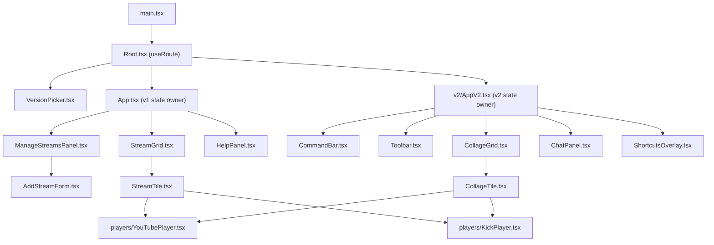

# ARP Multi View — Technical Specification

Design/reference document for developers. For end-user instructions, see [README.md](../README.md).
This file describes what each source file contains and what each function/component does, so
future changes can be made without re-reading the entire codebase.

The app contains **two independent UIs** behind a small path router:

- **v1** (`/v1`) — the original `App.tsx` grid. Documented in "Version 1" below.
- **v2** (`/v2`) — the `src/v2/` collage. Documented in "Version 2" below.

They share `src/types.ts`, `src/lib/*` (URL parsing, name lookup, localStorage hook, YouTube
API/embed helpers) and `src/components/players/*`. Everything else is version-specific.

## Stack & tooling

- **React 19 + TypeScript**, built with **Vite 8** (`@vitejs/plugin-react`).
- No backend, state library, or CSS framework — plain hooks, plain CSS, client-only.
- **No router dependency**: `src/router.tsx` is a ~40-line History-API hook (three routes, no
  params). Do not add `react-router` unless the route surface actually grows.
- Stylesheets: `src/index.css` (global reset + v1 theme variables), `src/App.css` (v1),
  `src/VersionPicker.css` (picker), `src/v2/v2.css` (v2, everything scoped under `.v2`).
- Lint: **Oxlint** (`.oxlintrc.json` — `react/rules-of-hooks: error`,
  `react/only-export-components: warn`). Run via `npm run lint`. The tree is warning-free;
  keep it that way (notably: don't write to a ref during render, and don't call `setState`
  synchronously inside an effect).
- Build: `npm run build` runs `tsc -b` (project-wide type check, no emit) then `vite build`.
- `tsconfig.app.json`: `target: es2023`, `moduleResolution: bundler`, `noUnusedLocals`/
  `noUnusedParameters`/`erasableSyntaxOnly` all on — dead/unused code and TS-only (non-erasable)
  syntax fail the build.
- No test runner is configured.

## Project structure

```
src/
  main.tsx                    — entry point, mounts <Root/>
  Root.tsx                    — route -> version switch
  router.tsx                  — History-API route hook + navigate()
  VersionPicker.tsx/.css      — landing page at "/"
  index.css                   — global reset + v1 theme CSS variables
  types.ts                    — shared domain types (both versions)

  App.tsx                     — v1 root: state + handlers + toolbar
  App.css                     — v1 component styles

  lib/                        — shared by both versions
    parseStreamUrl.ts         — URL -> StreamSource parsing
    streamTitle.ts            — best-effort title/channel name lookup
    layout.ts                 — v1 grid CSS generation (auto/2x2/4x4 + Spotlight)
    useLocalStorage.ts        — generic persisted-state hook
    youtubeApi.ts             — loads the YouTube IFrame Player API script once
    youtubeEmbed.ts           — builds YouTube iframe embed src URLs
    youtube.d.ts              — hand-written YT.* global type declarations

  components/                 — v1 components, except players/ (shared)
    ManageStreamsPanel.tsx    — collapsible URL list (+ AddStreamForm)
    AddStreamForm.tsx         — paste-URLs textarea + add button
    StreamGrid.tsx            — lays out tiles for the active layout mode
    StreamTile.tsx            — one tile: toolbar + embedded player + drag/drop
    HelpPanel.tsx             — in-app usage guide (modal)
    ProviderIcon.tsx          — YouTube/Kick circular glyph
    players/                  — SHARED by v1 and v2
      YouTubePlayer.tsx       — YouTube iframe + IFrame Player API wiring
      KickPlayer.tsx          — Kick iframe (no parent-page control API)

  v2/
    AppV2.tsx                 — v2 root: collage state + handlers
    v2.css                    — all v2 styles, scoped under `.v2`
    components/
      CommandBar.tsx          — debounced smart-search box + results
      Toolbar.tsx             — counters, column slider, sound/quality/sync/share/clear
      CollageGrid.tsx         — column grid, focus mode, empty state
      CollageTile.tsx         — one collage tile: bar + player + live badge + drag
      ChatPanel.tsx           — one chat card in the right-hand rail
      ShortcutsOverlay.tsx    — keyboard cheat sheet modal
    lib/
      smartSearch.ts          — name/URL/id -> addable candidates (no API key)
      liveStatus.ts           — Kick live-state lookup
      chatEmbed.ts            — chat iframe + external chat URLs
      shareLink.ts            — collage <-> query-string encoding
      useShortcuts.ts         — global keydown handling
```

## Routing

`src/router.tsx` exports:

- `Route = 'picker' | 'v1' | 'v2'`.
- `routeFromPath(pathname)` — normalizes trailing slashes and case; anything that isn't
  `/v1` or `/v2` resolves to `'picker'`.
- `navigate(path)` — `history.pushState` plus a synthetic `arp:navigate` event, because
  `popstate` does **not** fire for programmatic pushes.
- `useRoute()` — subscribes to both `popstate` and `arp:navigate` and returns the current
  `Route`.

`src/Root.tsx` maps the route to `<App/>`, `<AppV2/>`, or `<VersionPicker/>`. It is a separate
file from `main.tsx` so `main.tsx` stays export-free (Fast Refresh / `only-export-components`).

Because routing is history-based, the host must rewrite unknown paths to `index.html`. Vite's
dev and preview servers already do; `public/_redirects` (`/* /index.html 200`) covers the
Cloudflare Pages deployment. Any new deploy target needs its own equivalent.

## Architecture / data flow

Both versions use the same pattern: one root component owns all state and passes the `streams`
array plus mutator callbacks downward. No context, no store.



In v1, `App.tsx` passes the same `streams` array to both `ManageStreamsPanel` (the editable row
list) and `StreamGrid` (the video tiles), so the two views never fall out of sync — every
mutation goes through one of `App.tsx`'s handlers, which calls `setStreams` once.

v1 state is `useLocalStorage` (see table below) plus non-persisted `useState`: `playSignal`
(a counter telling every `YouTubePlayer` to attempt `playVideo()`) and `isMaximized`/`showHelp`.

## Persisted state (`useLocalStorage` keys)

| Key                          | Type                | Default     | Owner                     |
|------------------------------|---------------------|-------------|---------------------------|
| `arp-multi-view:streams`    | `StreamSource[]`    | `[]`        | `App.tsx` `streams`       |
| `arp-multi-view:layout`     | `LayoutMode`        | `'auto'`    | `App.tsx` `layout`        |
| `arp-multi-view:spotlight`  | `string \| null`    | `null`      | `App.tsx` `spotlightId`   |
| `arp-multi-view:theme`      | `ThemeName`         | `'midnight'`| `App.tsx` `theme`         |
| `arp-multi-view:titleMode`  | `TitleMode`         | `'video'`   | `App.tsx` `titleMode`     |
| `arp-multi-view:v2:streams` | `StreamSource[]`    | `[]`        | `AppV2.tsx` `streams`     |
| `arp-multi-view:v2:columns` | `number`            | `2`         | `AppV2.tsx` `columns`     |
| `arp-multi-view:v2:quality` | `string`            | `'default'` | `AppV2.tsx` `quality`     |

The `v2:` prefix is what keeps the two versions from overwriting each other's saved layout;
any new v2 persisted key must keep it.

`useLocalStorage<T>(key, initialValue)` (`lib/useLocalStorage.ts`) is a generic `useState`
drop-in: lazily reads `localStorage[key]` once on mount (falling back to `initialValue` on
missing/corrupt JSON), and re-writes it in a `useEffect` on every change. Both read and write
are wrapped in `try/catch` — persistence is best-effort (private browsing, storage quota, or a
disabled `localStorage` won't crash the app, it just won't remember state).

v2's `soundOn`, `activeId`, `focusedId`, `chatIds`, `playSignal`, `showShortcuts`, `shareLabel`
and `liveStates` are deliberately **not** persisted — they are per-session UI state.

## `src/types.ts`

- `StreamTarget` — discriminated union describing how a stream is embedded:
  `{ kind: 'youtube-video'; videoId }` | `{ kind: 'youtube-channel'; channelId }` (a channel's
  current live broadcast) | `{ kind: 'kick-channel'; slug }`.
- `Provider = 'youtube' | 'kick'` — collapses both YouTube kinds for UI grouping.
- `StreamSource` — one tile's full record: `{ id, url, label, target, muted }`. `label` is the
  placeholder shown until/unless `fetchStreamNames` resolves a real name.
- `LayoutMode = 'auto' | 'grid2x2' | 'grid4x4' | 'spotlight'`.
- `ThemeName = 'midnight' | 'ember' | 'aurora'`.
- `TitleMode = 'video' | 'channel'` — which resolved name a tile prefers to display.
- `providerOf(target): Provider` — maps a `StreamTarget.kind` to its `Provider` by checking
  whether `kind` starts with `'youtube'`.

## `src/main.tsx`

Mounts `<Root />` into `#root` (from `index.html`) inside `<StrictMode>`. Deliberately contains
no exports so Fast Refresh keeps working.

## `src/Root.tsx`

`Root()` — calls `useRoute()` and renders `<App/>` for `'v1'`, `<AppV2/>` for `'v2'`, else
`<VersionPicker/>`.

## `src/VersionPicker.tsx` / `.css`

`VersionPicker()` — the `/` landing page: two cards describing v1 and v2, each calling
`navigate('/v1')` / `navigate('/v2')` on click. Self-contained styling in `VersionPicker.css`
(it does not use v1's theme variables).

## `src/App.tsx` (version 1 root)

Root component. Declares the `LAYOUTS`/`THEMES` option lists used to render the toolbar
buttons, holds all state (see table above), and defines these handlers:

| Function | Responsibility |
|---|---|
| `handleAdd(rawText)` | Parses one or more pasted URLs via `parseStreamUrls`, appends the ones that parsed and aren't already in `streams` (exact URL match), returns the `ParseFailure[]` for the caller to display. |
| `handleRemove(id)` | Removes a stream by id; clears `spotlightId` if the removed stream was the current spotlight. |
| `handleUpdateUrl(id, rawUrl)` | Re-parses a single edited URL via `parseStreamUrl`; rejects duplicates of another existing stream; replaces `url`/`label`/`target` in place (keeps `id`/`muted`); returns an error string or `null`. |
| `handleReorder(draggedId, targetId)` | Splices the dragged stream out of `streams` and re-inserts it at the target's index. Shared by both tile drag-and-drop (`StreamGrid`/`StreamTile`) and row drag-and-drop (`ManageStreamsPanel`). |
| `handleToggleMute(id)` | Flips one stream's `muted` flag. |
| `handleMuteAll(muted)` | Sets `muted` on every stream whose `target.kind` starts with `'youtube'`; Kick streams are untouched (no parent-control API). |
| `handlePlayAll()` | Increments `playSignal`; every mounted `YouTubePlayer` reacts by attempting `playVideo()` if its player instance is ready. |

Render structure: corner controls (back-to-picker `←`, Help toggle `ℹ`, Maximize/Show-controls
toggle) → conditionally rendered `HelpPanel` → `app__controls` (header, `ManageStreamsPanel`,
toolbar with layout switch / theme switch / action switch: title-mode toggle `🎬`/`👤`, Play all
`▶`, Mute all `🔇`, Unmute all `🔊`) → `app__stage` containing `StreamGrid`. When `isMaximized`
is true, CSS (`.app--maximized`) hides `app__controls` and expands `app__stage` to fill the
viewport.

## `src/lib/parseStreamUrl.ts`

- `SAFE_ID` — `^[A-Za-z0-9_-]{1,64}$` whitelist regex applied to every id before it's embedded
  into a constructed iframe `src` (defense in depth).
- `ParseSuccess { ok: true; source: StreamSource }`, `ParseFailure { ok: false; input; error }`,
  `ParseResult = ParseSuccess | ParseFailure`.
- `fail(input, error)` — builds a `ParseFailure`.
- `makeSource(url, target, label)` — builds a `ParseSuccess` with a fresh `crypto.randomUUID()`
  id and `muted: true` (streams always start muted).
- `parseYouTube(url, raw)` — recognizes `youtu.be/<id>`, `watch?v=`, `/embed/<id>`,
  `/embed/live_stream?channel=<id>`, `/live|shorts|v/<id>`, `/channel/<id>`. Explicitly rejects
  `/@handle` URLs (resolving a handle needs the YouTube Data API, which this app doesn't call).
- `parseKick(url, raw)` — extracts a channel slug from `kick.com/<slug>` or
  `player.kick.com/<slug>`; rejects reserved path segments (`category`, `browse`, `search`,
  `subscriptions`, `following`, `settings`) and `/videos/...` VOD links (not embeddable).
- `parseStreamUrl(rawInput)` — trims input, defaults a missing scheme to `https://`, rejects
  non-http(s) schemes, dispatches to `parseYouTube`/`parseKick` by hostname, or fails with
  "Only youtube.com, youtu.be, and kick.com URLs are supported."
- `parseStreamUrls(input)` — splits pasted text on newlines/commas and calls `parseStreamUrl`
  on each non-empty line independently.

## `src/lib/streamTitle.ts`

- `REQUEST_TIMEOUT_MS = 5000`.
- `fetchJson(url)` — `fetch` with an `AbortController` timeout; returns parsed JSON on an OK
  response, or `null` on any network error, non-OK status, CORS block, or timeout (never
  throws).
- `ResolvedStreamNames { videoName: string | null; channelName: string | null }`.
- `fetchStreamNames(target)`:
  - `youtube-video` — calls YouTube's public oEmbed endpoint
    (`youtube.com/oembed?url=...&format=json`, no API key needed); returns `title` as
    `videoName` and `author_name` as `channelName`.
  - `kick-channel` — calls Kick's public channel API
    (`kick.com/api/v2/channels/<slug>`); returns `user.username` as `channelName` and, if
    live, `livestream.session_title` as `videoName`.
  - `youtube-channel` (a channel's live broadcast) — returns `{ null, null }`; there's no
    single video URL to resolve client-side for this target kind.

## `src/lib/layout.ts`

- `computeGridStyle(mode, count)` — returns `gridTemplateColumns` for the non-Spotlight grid:
  fixed `repeat(2, ...)` / `repeat(4, ...)` for `grid2x2`/`grid4x4`, or
  `repeat(ceil(sqrt(count)), ...)` for `auto` so the grid stays roughly square.
- `computeSpotlightGridStyle(sideCount)` — returns `gridTemplateRows` for Spotlight's single
  shared grid container: one explicit row per side tile (minimum 1), so the main tile's CSS
  `grid-row: 1 / -1` (in `App.css`) can resolve `-1` against an explicit last line.

## `src/lib/useLocalStorage.ts`

`useLocalStorage<T>(key, initialValue)` — see "Persisted state" above.

## `src/lib/youtubeApi.ts`

`loadYouTubeApi()` — memoizes a single shared `Promise<typeof YT>` (`apiPromise`) so the
`https://www.youtube.com/iframe_api` script tag is injected and `window.onYouTubeIframeAPIReady`
is registered at most once, no matter how many `YouTubePlayer` instances call this. Chains onto
any pre-existing `onYouTubeIframeAPIReady` callback instead of overwriting it.

## `src/lib/youtubeEmbed.ts`

`buildYouTubeEmbedSrc(target)` — builds the iframe `src`:
`autoplay=0&mute=1&playsinline=1&rel=0&enablejsapi=1&origin=<window.location.origin>`, plus
either `/embed/<videoId>` or (`youtube-channel` targets) `/embed/live_stream?channel=<channelId>`.
`enablejsapi=1` + matching `origin` are required for the IFrame Player API to postMessage into
this iframe.

## `src/lib/youtube.d.ts`

Hand-written ambient declarations for only the `YT.*` surface this app calls: `Window.YT`,
`Window.onYouTubeIframeAPIReady`, and `YT.Player` (`constructor`, `playVideo`, `pauseVideo`,
`mute`, `unMute`, `isMuted`, `setVolume`, `setPlaybackQuality`, `destroy`) plus its event option
types (`onReady`/`onStateChange`/`onError`). Declared as a global namespace since the real
script attaches `window.YT`, not an ES module. Add a declaration here before calling any new
player method.

## `src/components/ManageStreamsPanel.tsx`

- `ManageStreamsPanel({ streams, onAdd, onRemove, onUpdateUrl, onReorder })` — a `<details open>`
  collapsible panel; renders `AddStreamForm` then one `StreamRow` per stream.
- `StreamRow({ index, source, onRemove, onUpdateUrl, onReorder })` — one editable row:
  - Local `value` state holds the draft URL text; only committed to the app via `onUpdateUrl`
    on submit (typing doesn't touch the grid until confirmed).
  - `handleSubmit` — no-ops (just clears any stale error) if the value is unchanged from
    `source.url`; otherwise calls `onUpdateUrl` and displays any returned error string.
  - `handleDragStart`/`handleDragOver`/`handleDrop` — native HTML5 drag-and-drop: stashes
    `source.id` in `dataTransfer`, and on drop calls `onReorder(draggedId, source.id)`. This
    row is always draggable (unlike tiles, which disable dragging in Spotlight).
  - Renders: drag indicator `⠿`, row index, `ProviderIcon`, URL text input, update button `✓`,
    remove button `🗑`, and an inline error message if `onUpdateUrl` returned one.

## `src/components/AddStreamForm.tsx`

`AddStreamForm({ onAdd })` — a `<textarea>` (one/comma-separated URLs per line) + `➕` submit
button. `handleSubmit` calls `onAdd(text)`; clears the textarea only if there were zero
failures, otherwise leaves the text in place and lists each `ParseFailure` (`input: error`)
below the form.

## `src/components/StreamGrid.tsx`

`StreamGrid({ streams, layout, spotlightId, titleMode, playSignal, onRemove, onReorder,
onToggleMute, onSetSpotlight })`:
- Renders an empty-state message if `streams.length === 0`.
- `tileProps(source)` — the prop bag shared by every `StreamTile` regardless of layout
  (`spotlightEnabled: layout === 'spotlight'`, plus all the passthrough callbacks).
- **Spotlight branch**: computes `mainId` (falls back to `streams[0].id` if `spotlightId` is
  unset or points to a removed stream), then renders all streams as flat siblings inside one
  `.spotlight-layout` container — never nested "main" vs "side" wrapper elements — so that
  switching which stream is spotlighted only changes CSS classes/props on already-mounted
  tiles instead of moving a tile between parents (which would force React to unmount/remount
  it, reloading the embedded player). `computeSpotlightGridStyle` sizes the shared grid rows.
- **Grid branch** (`auto`/`grid2x2`/`grid4x4`): renders one `StreamTile` per stream inside
  `.stream-grid`, sized by `computeGridStyle`.

## `src/components/StreamTile.tsx`

`StreamTile({ source, isSpotlight, spotlightEnabled, titleMode, playSignal, onRemove,
onReorder, onToggleMute, onSetSpotlight })` — one tile's toolbar + embedded player.

- `resolvedNames` state — `{ videoName, channelName }`, both `null` until resolved.
- On `source.target` changing (render-time check against `lastTarget`, not a `useEffect`, so
  the stale name never flashes for a frame): resets `resolvedNames` back to empty.
- `useEffect` on `[source.target]` — calls `fetchStreamNames(source.target)`; a `cancelled`
  flag discards the result if the target changed again before the request finished.
- `preferredName` — `resolvedNames.channelName` or `.videoName` depending on `titleMode`;
  `title` falls back to `source.label` if the preferred name is still `null`.
- `canSwitchToSpotlight = spotlightEnabled && !isSpotlight` — shows the `⤢` "make main" button
  only on Spotlight side tiles.
- `isDraggable = !spotlightEnabled` — tile dragging is grid-layout-only; Spotlight uses the
  `⤢` switch instead (dragging directly on the embedded video wouldn't work anyway, since the
  player captures the mouse there).
- `handleFullscreen()` — calls `tileRef.current.requestFullscreen()`.
- `handleDragStart`/`handleDragOver`/`handleDrop` — same native drag-and-drop pattern as
  `ManageStreamsPanel`'s `StreamRow`, calling `onReorder(draggedId, source.id)` on drop.
- Renders `ProviderIcon`, the resolved title, a mute toggle (YouTube tiles only), fullscreen
  button `⛶`, the Spotlight switch button `⤢` (conditionally), and remove button `🗑`, then
  either `YouTubePlayer` or `KickPlayer` based on `source.target.kind`, plus a hint paragraph
  for Kick tiles pointing at the player's own controls.

## `src/components/HelpPanel.tsx`

`HelpPanel({ onClose })` — a modal overlay (click outside or `✕` to close, via
`event.stopPropagation()` on the inner panel) presenting a curated, end-user-facing subset of
`README.md`'s version 1 content: Versions, Adding streams, Managing your list, Layouts,
Per-tile controls, Toolbar-wide controls, Themes & persistence, Known limitations. Opened from
`App.tsx`'s `ℹ` corner button; hidden while `isMaximized`. v2 has no equivalent panel — its
`ShortcutsOverlay` covers keys only, and its empty state carries the onboarding text.

## `src/components/ProviderIcon.tsx`

`ProviderIcon({ provider })` — a small colored circular `<span role="img">` glyph: a red circle
with a white play-triangle SVG (`viewBox 0 0 24 24`, rendered at `20x20`) for `'youtube'`, or a
green circle with a dark Kick bracket-mark SVG (rendered at `14x14`) for `'kick'`. `LABEL` maps
each provider to its `aria-label`/`title` text ("YouTube"/"Kick").

## `src/components/players/YouTubePlayer.tsx`

Shared by v1 and v2. `YouTubePlayer({ target, muted, playSignal, quality })`:
- Builds `src` via `buildYouTubeEmbedSrc(target)`.
- `mutedRef` mirrors the `muted` prop so the one-time `onReady` callback always reads the
  latest desired mute state (not the value captured when the player was constructed).
- Main `useEffect` on `[src]` — calls `loadYouTubeApi()`, then constructs `new YT.Player(...)`
  against the iframe ref once the API resolves (guarded by a `cancelled` flag in case the tile
  unmounted mid-load). `onReady` mutes/unmutes per `mutedRef.current` (guarded: on some
  networks the player wrapper exists before its methods are actually callable). `onError` sets
  a user-facing `error` state ("This video is unavailable or cannot be embedded."). Cleanup
  destroys the player instance.
- `useEffect` on `[muted]` — applies the mute toggle to the live player (same "methods may not
  be callable yet" guard).
- `useEffect` on `[playSignal]` — skips the initial `0`; every subsequent increment calls
  `playVideo()` if the player is ready.
- `useEffect` on `[quality, playSignal]` — v2 only. No-ops when `quality` is undefined (v1
  passes nothing), otherwise calls `setPlaybackQuality(quality)`. Re-applied on `playSignal`
  because YouTube resets the suggestion when playback (re)starts. The value is only a hint;
  YouTube ignores it if the stream has no matching rendition.
- Renders the error message instead of the iframe if `onError` fired; otherwise the iframe
  itself (`allow="autoplay; encrypted-media; picture-in-picture; fullscreen"`,
  `referrerPolicy="strict-origin-when-cross-origin"`).

## `src/components/players/KickPlayer.tsx`

Shared by v1 and v2. `KickPlayer({ target })` — a plain iframe at
`https://player.kick.com/<slug>?autoplay=false&muted=true`. No JS API wiring: Kick doesn't
expose a documented parent-page control API, so `StreamTile` shows a hint telling the user to
use the player's own on-screen controls instead.

## `src/App.css` / `src/index.css`

- `index.css` — base reset (`* { box-sizing: border-box }`, `body`, `button`), `:root` defines
  the default (Midnight) theme's CSS custom properties (`--bg`, `--panel`, `--border`, `--text`,
  `--text-muted`, `--accent`, `--accent-gradient`, `--danger`); `[data-theme='ember']` and
  `[data-theme='aurora']` override the same variables. `App.tsx` sets
  `document.documentElement.dataset.theme` to swap which block is active.
- `App.css` — every component-level rule (layout regions, forms, icon buttons, both grid
  systems, tile toolbar/player/hint) references those variables (`var(--accent)`, etc.) instead
  of hardcoding colors, so theme switches repaint automatically.

## Version 2 (`src/v2/`)

### `src/v2/AppV2.tsx`

`AppV2()` \u2014 the collage root and single owner of v2 state. `MAX_STREAMS = 12`.

State: `streams`/`columns`/`quality` (persisted, see the key table above) plus non-persisted
`soundOn`, `activeId` (hovered/focused tile), `focusedId`, `chatIds` (**array** \u2014 several
chats can be open at once), `playSignal`, `showShortcuts`, `shareLabel`, `liveStates`
(`Record<streamId, LiveState>`), and `searchInputRef`.

| Function | Responsibility |
|---|---|
| mount effect | Reads `readSharedCollage(location.search)`; if a `?s=` link is present it replaces `streams` (and `columns`), then `history.replaceState` drops the query so a later refresh doesn't re-apply someone else's collage over local edits. |
| `handleAdd(source)` | Appends a stream unless the collage is full or the URL is already present; forces `muted: !soundOn` so a new tile matches the current sound state. |
| `handleRemove(id)` | Removes the stream and prunes it from `focusedId`, `chatIds`, and `activeId`. |
| `handleReorder(draggedId, targetId)` | Splice-and-reinsert, same shape as v1's. |
| `handleToggleMute(id)` | Flips one stream's `muted` flag. |
| `handleToggleSound()` | Global switch: sets `muted: !next` on every `youtube-*` stream. Kick is untouched (no control API). |
| `handleToggleFocus(id)` | Toggles `focusedId`; `null` id is a no-op (nothing hovered). |
| `handleToggleChat(id)` | Adds/removes `id` in `chatIds`, so chats **stack** in the rail instead of replacing each other. |
| `handleShare()` | Copies `buildShareUrl(streams, columns)` to the clipboard; on failure (denied permission / insecure context) falls back to putting the link in the address bar. Either way `shareLabel` shows feedback for 2.5s. |
| `handleClear()` | Empties streams, focus, chats, active tile, and live states. |
| `handleLiveStateChange(id, state)` | `useCallback` (must stay stable \u2014 `CollageTile` polls on an interval keyed to it); writes into `liveStates`, from which `liveCount` is derived. |

`targetId` \u2014 the tile a keyboard shortcut applies to: `activeId` if it still exists, else the
first stream. Passed to `CollageGrid` as `activeId` and used by the `F`/`C` shortcuts.

Render: aurora backdrop \u2192 header (back-to-picker `\u2190`, title, `CommandBar`) \u2192 `Toolbar` \u2192
`v2-stage` containing `CollageGrid` and, when any chat is open, a `v2-chat-rail` of
`ChatPanel`s plus one explanatory note \u2192 `ShortcutsOverlay` when toggled.

### `src/v2/components/CommandBar.tsx`

`CommandBar({ inputRef, disabled, onAdd })` \u2014 debounced (`DEBOUNCE_MS = 350`) smart search.

- `runIdRef` \u2014 a monotonically increasing sequence number; only the newest run may write
  state, so a slow earlier request can't overwrite newer results.
- The effect on `[query]` **returns early on empty input** rather than clearing state, and
  `setIsSearching(true)` happens in `onChange`. Both are deliberate: calling `setState`
  synchronously inside an effect trips Oxlint's `react/set-state-in-effect`.
- `reset()` \u2014 clears query/results/message and bumps `runIdRef` so in-flight results are
  discarded.
- `Enter` adds the first candidate; `Escape` resets and blurs. `disabled` is set by `AppV2`
  when the collage is full.

### `src/v2/components/Toolbar.tsx`

`Toolbar({...})` \u2014 presentational sticky strip: `N/max streams` and `N live` counters, the
1\u20136 column range input, the sound pill, the `QUALITIES` select (`default`, `hd1080`, `hd720`,
`large`, `medium`, `small` \u2014 YouTube's own quality tokens), Sync, Share, Shortcuts, Clear.
Holds no state of its own.

### `src/v2/components/CollageGrid.tsx`

`CollageGrid({ streams, columns, activeId, focusedId, chatIds, playSignal, quality, ...callbacks })`:

- Empty `streams` \u2192 the onboarding empty state.
- **Focus branch** (a valid `focusedId`): the focused tile renders in `v2-focus__main`, the
  rest in a scrollable `v2-focus__strip`. Note that, unlike v1's Spotlight, this branch *does*
  move tiles between parents, so switching focus remounts players. Acceptable here because
  focus is an explicit user action; don't extend it to something that toggles frequently.
- **Grid branch**: `--v2-cols` custom property set to `min(columns, streams.length)`.

### `src/v2/components/CollageTile.tsx`

`CollageTile({ source, index, isActive, isFocused, isChatOpen, playSignal, quality, ...callbacks })`:

- Resolves display names via `fetchStreamNames` on `[source.target]`, with a `cancelled` guard.
- Polls `fetchLiveState` immediately and every `LIVE_POLL_MS` (60s), reporting upward through
  `onLiveStateChange`. The effect intentionally omits `onLiveStateChange` from its deps (it is
  a stable `useCallback`) so the interval isn't restarted on every render.
- `dragArmed` \u2014 the tile is only `draggable` while the `\u2831` grip is held (`onMouseDown` arms,
  `onMouseUp`/`onDragEnd` disarms), so dragging inside a player never starts a reorder.
- `onMouseEnter`/`onFocusCapture` call `onActivate`, which is what makes the `F`/`C` shortcuts
  apply to the tile under the cursor.
- Renders: grip, provider badge, LIVE/OFFLINE badge, channel + title, index, then mute
  (YouTube only), chat, focus, fullscreen and remove buttons, then `YouTubePlayer` or
  `KickPlayer`.

### `src/v2/components/ChatPanel.tsx`

`ChatPanel({ source, onClose })` \u2014 one card in the chat rail. Resolves the channel name with
its own `fetchStreamNames` call (served from the browser cache in practice, since the matching
tile already asked) so the header isn't a raw video id. Renders `buildChatEmbed(...).src` in a
sandboxed iframe, or the "no chat for a channel live-stream embed" message when `src` is null.
The `\u2197` external link is always shown, because a provider or network filter refusing to be
framed is not detectable from here.

### `src/v2/components/ShortcutsOverlay.tsx`

`ShortcutsOverlay({ onClose })` \u2014 modal cheat sheet driven by the `SHORTCUTS` array. Keep that
array in sync with `useShortcuts.ts` and the README table.

### `src/v2/lib/smartSearch.ts`

- `SearchCandidate { key, source, displayName, subtitle, live }`,
  `SearchOutcome { candidates, message }`.
- `searchStreams(rawQuery)`:
  - A recognizable YouTube/Kick **URL** short-circuits to `parseStreamUrl` (one candidate, or
    the parse error as `message`).
  - Otherwise `slugVariants(query)` produces up to 3 likely Kick slugs (hyphenated,
    stripped, underscored) and each is looked up via `lookupKick`.
  - `UC...` matches add a `youtube-channel` candidate directly; an 11-char id is verified via
    `lookupYouTubeVideo` (oEmbed).
  - Results are de-duplicated by `key`; an empty result returns a `message` telling the user
    to paste a YouTube link.
- `lookupKick(slug)` \u2014 `kick.com/api/v2/channels/<slug>`; returns display name, session title
  (or the channel URL) and `live`.
- `lookupYouTubeVideo(videoId)` \u2014 YouTube oEmbed; returns author + title.
- **No API key anywhere.** YouTube channel-name search is impossible client-side; do not add a
  scraping workaround.

### `src/v2/lib/liveStatus.ts`

`LiveState = 'live' | 'offline' | 'unknown'`. `fetchLiveState(target)` returns `'unknown'` for
anything that isn't `kick-channel`; for Kick it reads `livestream` from the public channel
endpoint. YouTube live detection needs the YouTube Data API, so YouTube tiles show a neutral
badge and are not counted in the header's live counter.

### `src/v2/lib/chatEmbed.ts`

`buildChatEmbed(target) -> { src, externalUrl }`:

- `youtube-video` \u2014 `youtube.com/live_chat?v=<id>&embed_domain=<location.hostname>&dark_theme=1`.
  `embed_domain` must match the hosting page or YouTube refuses the frame.
- `kick-channel` \u2014 `kick.com/popout/<slug>/chat`, external `kick.com/<slug>/chatroom`.
- `youtube-channel` \u2014 `src: null` (no video id is known up front), external `/live` URL.

Both providers legitimately render "chat is disabled" for a stream that is not live; that is
their message, not an app error.

### `src/v2/lib/shareLink.ts`

Encoding: `?s=<token>~<token>&c=<columns>`, token = `yt.<videoId>` | `yc.<channelId>` |
`kc.<slug>`.

- `buildShareUrl(streams, columns)` \u2014 absolute `/v2` URL, capped at `MAX_STREAMS`.
- `readSharedCollage(search)` \u2014 decodes, **re-validating every id against `SAFE_ID`** before it
  can reach an iframe `src` (the string comes from an untrusted link), caps the list at 12 and
  clamps `c` to 1\u20136. Returns `null` when there is nothing to restore.

### `src/v2/lib/useShortcuts.ts`

`useShortcuts(handlers)` \u2014 installs one `keydown` listener for the lifetime of the component.
Handlers are kept in a ref that is synced **in an effect** (not during render \u2014 Oxlint's
`react/refs` rule), so the listener never needs re-binding. `isTypingTarget` skips everything
except `Escape` while focus is in an input/textarea/select/contenteditable, and modifier
combinations (Ctrl/Meta/Alt) are ignored so browser shortcuts keep working.

Keys: `/` focus search, `1`\u2013`6` columns, `M` sound, `F` focus, `C` chat, `S` sync, `?`
shortcut list, `Esc` (close overlay \u2192 close all chats \u2192 leave focus, in that order).

### `src/v2/v2.css`

Every rule is scoped under `.v2` so it cannot collide with `App.css` (both versions share one
document and one global `index.css` reset). The palette is defined as local custom properties
on `.v2` rather than reusing v1's `[data-theme]` variables \u2014 v2 has one fixed dark theme.
Contains the grid (`--v2-cols`), focus layout, tile chrome, chat rail, empty state, shortcut
overlay, responsive breakpoints at 900px/620px, and a `prefers-reduced-motion` block that
neutralizes every animation and transition.

## Config files

- `package.json` — scripts: `dev` (`vite`), `build` (`tsc -b && vite build`), `lint` (`oxlint`),
  `preview` (`vite preview`). Deps: `react`/`react-dom` 19; devDeps: `@vitejs/plugin-react`,
  `oxlint`, `typescript`, `vite`, plus `@types/*`.
- `vite.config.ts` — `defineConfig({ plugins: [react()] })`, no other customization.
- `tsconfig.app.json` — `target: es2023`, `moduleResolution: bundler`, `jsx: react-jsx`,
  `noUnusedLocals`/`noUnusedParameters`/`erasableSyntaxOnly` enabled (unused code or TS-only
  runtime syntax fails `tsc -b`).
- `.oxlintrc.json` — `react`, `typescript`, `oxc` plugins; `react/rules-of-hooks: error`,
  `react/only-export-components: warn`.
- `index.html` — the single HTML shell; mounts `#root` and loads `/src/main.tsx` as a module.
- `public/` — copied verbatim into `dist/`. Holds `favicon.svg`, `icons.svg`, and
  `_redirects` (`/* /index.html 200`), which is what makes `/v1` and `/v2` survive a hard
  refresh on Cloudflare Pages.
- `.github/workflows/deploy-pages.yml` — manual (`workflow_dispatch`) build + `wrangler pages
  deploy dist` to the `arp-multi-view` Cloudflare Pages project, from `main` only.
- `.github/copilot-instructions.md` — repository rules for contributors and AI agents
  (doc/comment upkeep, architecture constraints, validation commands). `AGENTS.md` points at
  it for agents that read that filename instead.

## Cross-cutting notes for future changes

- **Single source of truth**: never give `ManageStreamsPanel` or `StreamGrid` their own copy of
  stream state — both must keep reading/writing the same `streams` array in `App.tsx` via the
  existing handlers, or list/grid order will drift apart.
- **Spotlight remount avoidance**: keep all tiles as flat siblings of one parent in
  `StreamGrid.tsx`'s Spotlight branch. Introducing separate "main" vs "side" wrapper elements
  will cause React to remount the switched tile's embedded player.
- **YouTube player readiness**: `YT.Player` methods (`mute`, `unMute`, `playVideo`, ...) are not
  guaranteed callable immediately after construction; any new code calling into `playerRef`
  must guard with a `typeof player.<method> === 'function'` check, matching the existing
  pattern in `YouTubePlayer.tsx`.
- **Kick has no control API**: don't attempt to add programmatic mute/play for Kick tiles; only
  the on-screen player controls work.
- **`SAFE_ID` whitelist**: any new id/slug extracted from a pasted URL — or decoded from a
  share link — and later embedded into an iframe `src` must be validated against `SAFE_ID` (or
  an equivalent whitelist) before use.
- **Keep the versions separate**: v1 and v2 must not share component or state code. The only
  sanctioned shared surface is `src/types.ts`, `src/lib/*`, and `src/components/players/*`.
  When touching a shared file, check both callers — e.g. `YouTubePlayer`'s `quality` prop is
  optional precisely so v1 is unaffected.
- **Namespace v2 storage**: every new v2 `useLocalStorage` key must keep the
  `arp-multi-view:v2:` prefix, or it will collide with v1's saved state.
- **No API keys**: both versions are deliberately key-free and backend-free. That is why
  YouTube channel-name search and YouTube live detection are missing, not an oversight. Adding
  either means introducing the YouTube Data API and a place to keep the key — a real design
  change, not a patch.
- **Oxlint is warning-free**: the two rules that bite most often here are
  `react/set-state-in-effect` (see `CommandBar.tsx`) and `react/refs` (see `useShortcuts.ts`).
  Both files show the accepted workaround; follow those patterns rather than disabling rules.
